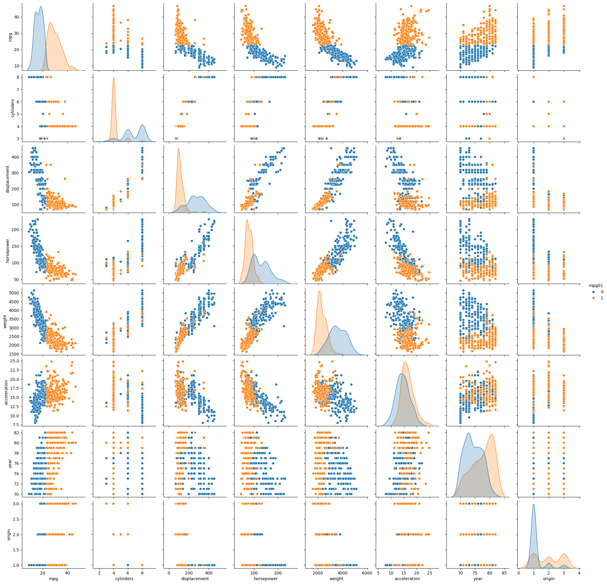

```python
import pandas as pd
import numpy as np
import seaborn as sns
```


```python
from ISLP import load_data, confusion_table
from sklearn.linear_model import LogisticRegression, LogisticRegressionCV
from sklearn.discriminant_analysis import LinearDiscriminantAnalysis as LDA, QuadraticDiscriminantAnalysis as QDA
from sklearn.naive_bayes import GaussianNB
from sklearn.neighbors import KNeighborsClassifier
from sklearn.model_selection import train_test_split, KFold
from sklearn.preprocessing import StandardScaler, PolynomialFeatures
from sklearn.pipeline import make_pipeline
```


```python
auto = load_data("Auto")
auto = auto.reset_index()
auto
```


<div>
<style scoped>
    .dataframe tbody tr th:only-of-type {
        vertical-align: middle;
    }

    .dataframe tbody tr th {
        vertical-align: top;
    }

    .dataframe thead th {
        text-align: right;
    }
</style>
<table border="1" class="dataframe">
  <thead>
    <tr style="text-align: right;">
      <th></th>
      <th>name</th>
      <th>mpg</th>
      <th>cylinders</th>
      <th>displacement</th>
      <th>horsepower</th>
      <th>weight</th>
      <th>acceleration</th>
      <th>year</th>
      <th>origin</th>
    </tr>
  </thead>
  <tbody>
    <tr>
      <th>0</th>
      <td>chevrolet chevelle malibu</td>
      <td>18.0</td>
      <td>8</td>
      <td>307.0</td>
      <td>130</td>
      <td>3504</td>
      <td>12.0</td>
      <td>70</td>
      <td>1</td>
    </tr>
    <tr>
      <th>1</th>
      <td>buick skylark 320</td>
      <td>15.0</td>
      <td>8</td>
      <td>350.0</td>
      <td>165</td>
      <td>3693</td>
      <td>11.5</td>
      <td>70</td>
      <td>1</td>
    </tr>
    <tr>
      <th>2</th>
      <td>plymouth satellite</td>
      <td>18.0</td>
      <td>8</td>
      <td>318.0</td>
      <td>150</td>
      <td>3436</td>
      <td>11.0</td>
      <td>70</td>
      <td>1</td>
    </tr>
    <tr>
      <th>3</th>
      <td>amc rebel sst</td>
      <td>16.0</td>
      <td>8</td>
      <td>304.0</td>
      <td>150</td>
      <td>3433</td>
      <td>12.0</td>
      <td>70</td>
      <td>1</td>
    </tr>
    <tr>
      <th>4</th>
      <td>ford torino</td>
      <td>17.0</td>
      <td>8</td>
      <td>302.0</td>
      <td>140</td>
      <td>3449</td>
      <td>10.5</td>
      <td>70</td>
      <td>1</td>
    </tr>
    <tr>
      <th>...</th>
      <td>...</td>
      <td>...</td>
      <td>...</td>
      <td>...</td>
      <td>...</td>
      <td>...</td>
      <td>...</td>
      <td>...</td>
      <td>...</td>
    </tr>
    <tr>
      <th>387</th>
      <td>ford mustang gl</td>
      <td>27.0</td>
      <td>4</td>
      <td>140.0</td>
      <td>86</td>
      <td>2790</td>
      <td>15.6</td>
      <td>82</td>
      <td>1</td>
    </tr>
    <tr>
      <th>388</th>
      <td>vw pickup</td>
      <td>44.0</td>
      <td>4</td>
      <td>97.0</td>
      <td>52</td>
      <td>2130</td>
      <td>24.6</td>
      <td>82</td>
      <td>2</td>
    </tr>
    <tr>
      <th>389</th>
      <td>dodge rampage</td>
      <td>32.0</td>
      <td>4</td>
      <td>135.0</td>
      <td>84</td>
      <td>2295</td>
      <td>11.6</td>
      <td>82</td>
      <td>1</td>
    </tr>
    <tr>
      <th>390</th>
      <td>ford ranger</td>
      <td>28.0</td>
      <td>4</td>
      <td>120.0</td>
      <td>79</td>
      <td>2625</td>
      <td>18.6</td>
      <td>82</td>
      <td>1</td>
    </tr>
    <tr>
      <th>391</th>
      <td>chevy s-10</td>
      <td>31.0</td>
      <td>4</td>
      <td>119.0</td>
      <td>82</td>
      <td>2720</td>
      <td>19.4</td>
      <td>82</td>
      <td>1</td>
    </tr>
  </tbody>
</table>
<p>392 rows × 9 columns</p>
</div>


```python
auto['mpg01'] = np.where(auto['mpg'] > auto['mpg'].median(), 1, 0)
```


```python
sns.pairplot(auto, hue='mpg01')
```


    <seaborn.axisgrid.PairGrid at 0x796b727da720>


    

    


```python
features = ['displacement']
X = auto[features]
y = auto["mpg01"]
kf = KFold(n_splits=10, shuffle=True, random_state=1)
# scaler = StandardScaler()
# scaler.fit(auto[useful_features])
# X = scaler.transform(auto[useful_features])
```


```python
for i in range(1, 10):
    s = []
    for train_index, test_index in kf.split(X):
        X_train, y_train = X.loc[train_index], y.loc[train_index]
        X_test, y_test = X.loc[test_index], y.loc[test_index]
        model = make_pipeline(
            PolynomialFeatures(degree=i, include_bias=False),
            LogisticRegression(C=1)
        )
        model.fit(X_train, y_train)
        s.append((model.predict(X_test) == y_test).mean())
    print(i, (np.array(s)).mean())
```

    1 0.8900641025641025
    2 0.8900641025641025
    3 0.8951923076923076
    4 0.9028846153846155
    5 0.8876282051282051
    6 0.7150641025641026
    7 0.49967948717948724
    8 0.49967948717948724
    9 0.49967948717948724


```python
LogisticRegressionCV?
```


    Init signature:
    LogisticRegressionCV(
        *,
        Cs=10,
        fit_intercept=True,
        cv=None,
        dual=False,
        penalty='l2',
        scoring=None,
        solver='lbfgs',
        tol=0.0001,
        max_iter=100,
        class_weight=None,
        n_jobs=None,
        verbose=0,
        refit=True,
        intercept_scaling=1.0,
        multi_class='deprecated',
        random_state=None,
        l1_ratios=None,
    )
    Docstring:     
    Logistic Regression CV (aka logit, MaxEnt) classifier.
    
    See glossary entry for :term:`cross-validation estimator`.
    
    This class implements logistic regression using liblinear, newton-cg, sag
    or lbfgs optimizer. The newton-cg, sag and lbfgs solvers support only L2
    regularization with primal formulation. The liblinear solver supports both
    L1 and L2 regularization, with a dual formulation only for the L2 penalty.
    Elastic-Net penalty is only supported by the saga solver.
    
    For the grid of `Cs` values and `l1_ratios` values, the best hyperparameter
    is selected by the cross-validator
    :class:`~sklearn.model_selection.StratifiedKFold`, but it can be changed
    using the :term:`cv` parameter. The 'newton-cg', 'sag', 'saga' and 'lbfgs'
    solvers can warm-start the coefficients (see :term:`Glossary<warm_start>`).
    
    Read more in the :ref:`User Guide <logistic_regression>`.
    
    Parameters
    ----------
    Cs : int or list of floats, default=10
        Each of the values in Cs describes the inverse of regularization
        strength. If Cs is as an int, then a grid of Cs values are chosen
        in a logarithmic scale between 1e-4 and 1e4.
        Like in support vector machines, smaller values specify stronger
        regularization.
    
    fit_intercept : bool, default=True
        Specifies if a constant (a.k.a. bias or intercept) should be
        added to the decision function.
    
    cv : int or cross-validation generator, default=None
        The default cross-validation generator used is Stratified K-Folds.
        If an integer is provided, then it is the number of folds used.
        See the module :mod:`sklearn.model_selection` module for the
        list of possible cross-validation objects.
    
        .. versionchanged:: 0.22
            ``cv`` default value if None changed from 3-fold to 5-fold.
    
    dual : bool, default=False
        Dual (constrained) or primal (regularized, see also
        :ref:`this equation <regularized-logistic-loss>`) formulation. Dual formulation
        is only implemented for l2 penalty with liblinear solver. Prefer dual=False when
        n_samples > n_features.
    
    penalty : {'l1', 'l2', 'elasticnet'}, default='l2'
        Specify the norm of the penalty:
    
        - `'l2'`: add a L2 penalty term (used by default);
        - `'l1'`: add a L1 penalty term;
        - `'elasticnet'`: both L1 and L2 penalty terms are added.
    
        .. warning::
           Some penalties may not work with some solvers. See the parameter
           `solver` below, to know the compatibility between the penalty and
           solver.
    
    scoring : str or callable, default=None
        A string (see :ref:`scoring_parameter`) or
        a scorer callable object / function with signature
        ``scorer(estimator, X, y)``. For a list of scoring functions
        that can be used, look at :mod:`sklearn.metrics`. The
        default scoring option used is 'accuracy'.
    
    solver : {'lbfgs', 'liblinear', 'newton-cg', 'newton-cholesky', 'sag', 'saga'},             default='lbfgs'
    
        Algorithm to use in the optimization problem. Default is 'lbfgs'.
        To choose a solver, you might want to consider the following aspects:
    
        - For small datasets, 'liblinear' is a good choice, whereas 'sag'
          and 'saga' are faster for large ones;
        - For multiclass problems, all solvers except 'liblinear' minimize the full
          multinomial loss;
        - 'liblinear' might be slower in :class:`LogisticRegressionCV`
          because it does not handle warm-starting.
        - 'liblinear' can only handle binary classification by default. To apply a
          one-versus-rest scheme for the multiclass setting one can wrap it with the
          :class:`~sklearn.multiclass.OneVsRestClassifier`.
        - 'newton-cholesky' is a good choice for
          `n_samples` >> `n_features * n_classes`, especially with one-hot encoded
          categorical features with rare categories. Be aware that the memory usage
          of this solver has a quadratic dependency on `n_features * n_classes`
          because it explicitly computes the full Hessian matrix.
    
        .. warning::
           The choice of the algorithm depends on the penalty chosen and on
           (multinomial) multiclass support:
    
           ================= ============================== ======================
           solver            penalty                        multinomial multiclass
           ================= ============================== ======================
           'lbfgs'           'l2'                           yes
           'liblinear'       'l1', 'l2'                     no
           'newton-cg'       'l2'                           yes
           'newton-cholesky' 'l2',                          no
           'sag'             'l2',                          yes
           'saga'            'elasticnet', 'l1', 'l2'       yes
           ================= ============================== ======================
    
        .. note::
           'sag' and 'saga' fast convergence is only guaranteed on features
           with approximately the same scale. You can preprocess the data with
           a scaler from :mod:`sklearn.preprocessing`.
    
        .. versionadded:: 0.17
           Stochastic Average Gradient descent solver.
        .. versionadded:: 0.19
           SAGA solver.
        .. versionadded:: 1.2
           newton-cholesky solver.
    
    tol : float, default=1e-4
        Tolerance for stopping criteria.
    
    max_iter : int, default=100
        Maximum number of iterations of the optimization algorithm.
    
    class_weight : dict or 'balanced', default=None
        Weights associated with classes in the form ``{class_label: weight}``.
        If not given, all classes are supposed to have weight one.
    
        The "balanced" mode uses the values of y to automatically adjust
        weights inversely proportional to class frequencies in the input data
        as ``n_samples / (n_classes * np.bincount(y))``.
    
        Note that these weights will be multiplied with sample_weight (passed
        through the fit method) if sample_weight is specified.
    
        .. versionadded:: 0.17
           class_weight == 'balanced'
    
    n_jobs : int, default=None
        Number of CPU cores used during the cross-validation loop.
        ``None`` means 1 unless in a :obj:`joblib.parallel_backend` context.
        ``-1`` means using all processors. See :term:`Glossary <n_jobs>`
        for more details.
    
    verbose : int, default=0
        For the 'liblinear', 'sag' and 'lbfgs' solvers set verbose to any
        positive number for verbosity.
    
    refit : bool, default=True
        If set to True, the scores are averaged across all folds, and the
        coefs and the C that corresponds to the best score is taken, and a
        final refit is done using these parameters.
        Otherwise the coefs, intercepts and C that correspond to the
        best scores across folds are averaged.
    
    intercept_scaling : float, default=1
        Useful only when the solver 'liblinear' is used
        and self.fit_intercept is set to True. In this case, x becomes
        [x, self.intercept_scaling],
        i.e. a "synthetic" feature with constant value equal to
        intercept_scaling is appended to the instance vector.
        The intercept becomes ``intercept_scaling * synthetic_feature_weight``.
    
        Note! the synthetic feature weight is subject to l1/l2 regularization
        as all other features.
        To lessen the effect of regularization on synthetic feature weight
        (and therefore on the intercept) intercept_scaling has to be increased.
    
    multi_class : {'auto, 'ovr', 'multinomial'}, default='auto'
        If the option chosen is 'ovr', then a binary problem is fit for each
        label. For 'multinomial' the loss minimised is the multinomial loss fit
        across the entire probability distribution, *even when the data is
        binary*. 'multinomial' is unavailable when solver='liblinear'.
        'auto' selects 'ovr' if the data is binary, or if solver='liblinear',
        and otherwise selects 'multinomial'.
    
        .. versionadded:: 0.18
           Stochastic Average Gradient descent solver for 'multinomial' case.
        .. versionchanged:: 0.22
            Default changed from 'ovr' to 'auto' in 0.22.
        .. deprecated:: 1.5
           ``multi_class`` was deprecated in version 1.5 and will be removed in 1.7.
           From then on, the recommended 'multinomial' will always be used for
           `n_classes >= 3`.
           Solvers that do not support 'multinomial' will raise an error.
           Use `sklearn.multiclass.OneVsRestClassifier(LogisticRegressionCV())` if you
           still want to use OvR.
    
    random_state : int, RandomState instance, default=None
        Used when `solver='sag'`, 'saga' or 'liblinear' to shuffle the data.
        Note that this only applies to the solver and not the cross-validation
        generator. See :term:`Glossary <random_state>` for details.
    
    l1_ratios : list of float, default=None
        The list of Elastic-Net mixing parameter, with ``0 <= l1_ratio <= 1``.
        Only used if ``penalty='elasticnet'``. A value of 0 is equivalent to
        using ``penalty='l2'``, while 1 is equivalent to using
        ``penalty='l1'``. For ``0 < l1_ratio <1``, the penalty is a combination
        of L1 and L2.
    
    Attributes
    ----------
    classes_ : ndarray of shape (n_classes, )
        A list of class labels known to the classifier.
    
    coef_ : ndarray of shape (1, n_features) or (n_classes, n_features)
        Coefficient of the features in the decision function.
    
        `coef_` is of shape (1, n_features) when the given problem
        is binary.
    
    intercept_ : ndarray of shape (1,) or (n_classes,)
        Intercept (a.k.a. bias) added to the decision function.
    
        If `fit_intercept` is set to False, the intercept is set to zero.
        `intercept_` is of shape(1,) when the problem is binary.
    
    Cs_ : ndarray of shape (n_cs)
        Array of C i.e. inverse of regularization parameter values used
        for cross-validation.
    
    l1_ratios_ : ndarray of shape (n_l1_ratios)
        Array of l1_ratios used for cross-validation. If no l1_ratio is used
        (i.e. penalty is not 'elasticnet'), this is set to ``[None]``
    
    coefs_paths_ : ndarray of shape (n_folds, n_cs, n_features) or                    (n_folds, n_cs, n_features + 1)
        dict with classes as the keys, and the path of coefficients obtained
        during cross-validating across each fold and then across each Cs
        after doing an OvR for the corresponding class as values.
        If the 'multi_class' option is set to 'multinomial', then
        the coefs_paths are the coefficients corresponding to each class.
        Each dict value has shape ``(n_folds, n_cs, n_features)`` or
        ``(n_folds, n_cs, n_features + 1)`` depending on whether the
        intercept is fit or not. If ``penalty='elasticnet'``, the shape is
        ``(n_folds, n_cs, n_l1_ratios_, n_features)`` or
        ``(n_folds, n_cs, n_l1_ratios_, n_features + 1)``.
    
    scores_ : dict
        dict with classes as the keys, and the values as the
        grid of scores obtained during cross-validating each fold, after doing
        an OvR for the corresponding class. If the 'multi_class' option
        given is 'multinomial' then the same scores are repeated across
        all classes, since this is the multinomial class. Each dict value
        has shape ``(n_folds, n_cs)`` or ``(n_folds, n_cs, n_l1_ratios)`` if
        ``penalty='elasticnet'``.
    
    C_ : ndarray of shape (n_classes,) or (n_classes - 1,)
        Array of C that maps to the best scores across every class. If refit is
        set to False, then for each class, the best C is the average of the
        C's that correspond to the best scores for each fold.
        `C_` is of shape(n_classes,) when the problem is binary.
    
    l1_ratio_ : ndarray of shape (n_classes,) or (n_classes - 1,)
        Array of l1_ratio that maps to the best scores across every class. If
        refit is set to False, then for each class, the best l1_ratio is the
        average of the l1_ratio's that correspond to the best scores for each
        fold.  `l1_ratio_` is of shape(n_classes,) when the problem is binary.
    
    n_iter_ : ndarray of shape (n_classes, n_folds, n_cs) or (1, n_folds, n_cs)
        Actual number of iterations for all classes, folds and Cs.
        In the binary or multinomial cases, the first dimension is equal to 1.
        If ``penalty='elasticnet'``, the shape is ``(n_classes, n_folds,
        n_cs, n_l1_ratios)`` or ``(1, n_folds, n_cs, n_l1_ratios)``.
    
    n_features_in_ : int
        Number of features seen during :term:`fit`.
    
        .. versionadded:: 0.24
    
    feature_names_in_ : ndarray of shape (`n_features_in_`,)
        Names of features seen during :term:`fit`. Defined only when `X`
        has feature names that are all strings.
    
        .. versionadded:: 1.0
    
    See Also
    --------
    LogisticRegression : Logistic regression without tuning the
        hyperparameter `C`.
    
    Examples
    --------
    >>> from sklearn.datasets import load_iris
    >>> from sklearn.linear_model import LogisticRegressionCV
    >>> X, y = load_iris(return_X_y=True)
    >>> clf = LogisticRegressionCV(cv=5, random_state=0).fit(X, y)
    >>> clf.predict(X[:2, :])
    array([0, 0])
    >>> clf.predict_proba(X[:2, :]).shape
    (2, 3)
    >>> clf.score(X, y)
    0.98...
    File:           ~/Lab/islp/venv/lib/python3.12/site-packages/sklearn/linear_model/_logistic.py
    Type:           type
    Subclasses:     


```python

```


```python

```
