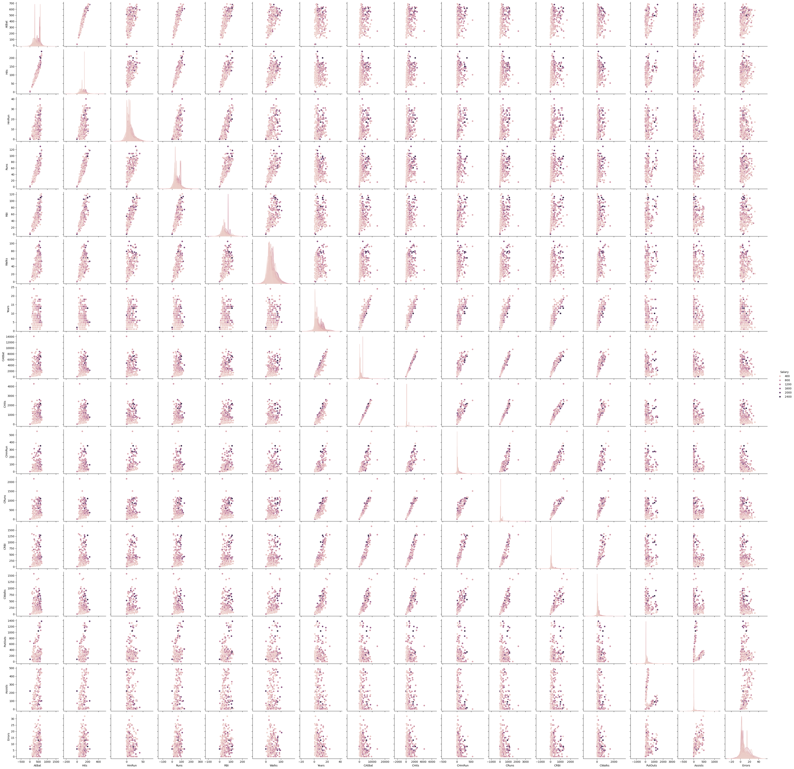

```python
import pandas as pd
import numpy as np
import seaborn as sns
import sklearn.linear_model as skl
import sklearn.model_selection as skm

from ISLP import load_data
from sklearn.preprocessing import StandardScaler
from sklearn.pipeline import Pipeline
from matplotlib.pyplot import subplots
```


```python
hits = load_data('Hitters')
hits.info()
hits.head()
```

    <class 'pandas.core.frame.DataFrame'>
    RangeIndex: 322 entries, 0 to 321
    Data columns (total 20 columns):
     #   Column     Non-Null Count  Dtype   
    ---  ------     --------------  -----   
     0   AtBat      322 non-null    int64   
     1   Hits       322 non-null    int64   
     2   HmRun      322 non-null    int64   
     3   Runs       322 non-null    int64   
     4   RBI        322 non-null    int64   
     5   Walks      322 non-null    int64   
     6   Years      322 non-null    int64   
     7   CAtBat     322 non-null    int64   
     8   CHits      322 non-null    int64   
     9   CHmRun     322 non-null    int64   
     10  CRuns      322 non-null    int64   
     11  CRBI       322 non-null    int64   
     12  CWalks     322 non-null    int64   
     13  League     322 non-null    category
     14  Division   322 non-null    category
     15  PutOuts    322 non-null    int64   
     16  Assists    322 non-null    int64   
     17  Errors     322 non-null    int64   
     18  Salary     263 non-null    float64 
     19  NewLeague  322 non-null    category
    dtypes: category(3), float64(1), int64(16)
    memory usage: 44.2 KB


<div>
<style scoped>
    .dataframe tbody tr th:only-of-type {
        vertical-align: middle;
    }

    .dataframe tbody tr th {
        vertical-align: top;
    }

    .dataframe thead th {
        text-align: right;
    }
</style>
<table border="1" class="dataframe">
  <thead>
    <tr style="text-align: right;">
      <th></th>
      <th>AtBat</th>
      <th>Hits</th>
      <th>HmRun</th>
      <th>Runs</th>
      <th>RBI</th>
      <th>Walks</th>
      <th>Years</th>
      <th>CAtBat</th>
      <th>CHits</th>
      <th>CHmRun</th>
      <th>CRuns</th>
      <th>CRBI</th>
      <th>CWalks</th>
      <th>League</th>
      <th>Division</th>
      <th>PutOuts</th>
      <th>Assists</th>
      <th>Errors</th>
      <th>Salary</th>
      <th>NewLeague</th>
    </tr>
  </thead>
  <tbody>
    <tr>
      <th>0</th>
      <td>293</td>
      <td>66</td>
      <td>1</td>
      <td>30</td>
      <td>29</td>
      <td>14</td>
      <td>1</td>
      <td>293</td>
      <td>66</td>
      <td>1</td>
      <td>30</td>
      <td>29</td>
      <td>14</td>
      <td>A</td>
      <td>E</td>
      <td>446</td>
      <td>33</td>
      <td>20</td>
      <td>NaN</td>
      <td>A</td>
    </tr>
    <tr>
      <th>1</th>
      <td>315</td>
      <td>81</td>
      <td>7</td>
      <td>24</td>
      <td>38</td>
      <td>39</td>
      <td>14</td>
      <td>3449</td>
      <td>835</td>
      <td>69</td>
      <td>321</td>
      <td>414</td>
      <td>375</td>
      <td>N</td>
      <td>W</td>
      <td>632</td>
      <td>43</td>
      <td>10</td>
      <td>475.0</td>
      <td>N</td>
    </tr>
    <tr>
      <th>2</th>
      <td>479</td>
      <td>130</td>
      <td>18</td>
      <td>66</td>
      <td>72</td>
      <td>76</td>
      <td>3</td>
      <td>1624</td>
      <td>457</td>
      <td>63</td>
      <td>224</td>
      <td>266</td>
      <td>263</td>
      <td>A</td>
      <td>W</td>
      <td>880</td>
      <td>82</td>
      <td>14</td>
      <td>480.0</td>
      <td>A</td>
    </tr>
    <tr>
      <th>3</th>
      <td>496</td>
      <td>141</td>
      <td>20</td>
      <td>65</td>
      <td>78</td>
      <td>37</td>
      <td>11</td>
      <td>5628</td>
      <td>1575</td>
      <td>225</td>
      <td>828</td>
      <td>838</td>
      <td>354</td>
      <td>N</td>
      <td>E</td>
      <td>200</td>
      <td>11</td>
      <td>3</td>
      <td>500.0</td>
      <td>N</td>
    </tr>
    <tr>
      <th>4</th>
      <td>321</td>
      <td>87</td>
      <td>10</td>
      <td>39</td>
      <td>42</td>
      <td>30</td>
      <td>2</td>
      <td>396</td>
      <td>101</td>
      <td>12</td>
      <td>48</td>
      <td>46</td>
      <td>33</td>
      <td>N</td>
      <td>E</td>
      <td>805</td>
      <td>40</td>
      <td>4</td>
      <td>91.5</td>
      <td>N</td>
    </tr>
  </tbody>
</table>
</div>


```python
hits.describe()
```


<div>
<style scoped>
    .dataframe tbody tr th:only-of-type {
        vertical-align: middle;
    }

    .dataframe tbody tr th {
        vertical-align: top;
    }

    .dataframe thead th {
        text-align: right;
    }
</style>
<table border="1" class="dataframe">
  <thead>
    <tr style="text-align: right;">
      <th></th>
      <th>AtBat</th>
      <th>Hits</th>
      <th>HmRun</th>
      <th>Runs</th>
      <th>RBI</th>
      <th>Walks</th>
      <th>Years</th>
      <th>CAtBat</th>
      <th>CHits</th>
      <th>CHmRun</th>
      <th>CRuns</th>
      <th>CRBI</th>
      <th>CWalks</th>
      <th>PutOuts</th>
      <th>Assists</th>
      <th>Errors</th>
      <th>Salary</th>
    </tr>
  </thead>
  <tbody>
    <tr>
      <th>count</th>
      <td>322.000000</td>
      <td>322.000000</td>
      <td>322.000000</td>
      <td>322.000000</td>
      <td>322.000000</td>
      <td>322.000000</td>
      <td>322.000000</td>
      <td>322.00000</td>
      <td>322.000000</td>
      <td>322.000000</td>
      <td>322.000000</td>
      <td>322.000000</td>
      <td>322.000000</td>
      <td>322.000000</td>
      <td>322.000000</td>
      <td>322.000000</td>
      <td>263.000000</td>
    </tr>
    <tr>
      <th>mean</th>
      <td>380.928571</td>
      <td>101.024845</td>
      <td>10.770186</td>
      <td>50.909938</td>
      <td>48.027950</td>
      <td>38.742236</td>
      <td>7.444099</td>
      <td>2648.68323</td>
      <td>717.571429</td>
      <td>69.490683</td>
      <td>358.795031</td>
      <td>330.118012</td>
      <td>260.239130</td>
      <td>288.937888</td>
      <td>106.913043</td>
      <td>8.040373</td>
      <td>535.925882</td>
    </tr>
    <tr>
      <th>std</th>
      <td>153.404981</td>
      <td>46.454741</td>
      <td>8.709037</td>
      <td>26.024095</td>
      <td>26.166895</td>
      <td>21.639327</td>
      <td>4.926087</td>
      <td>2324.20587</td>
      <td>654.472627</td>
      <td>86.266061</td>
      <td>334.105886</td>
      <td>333.219617</td>
      <td>267.058085</td>
      <td>280.704614</td>
      <td>136.854876</td>
      <td>6.368359</td>
      <td>451.118681</td>
    </tr>
    <tr>
      <th>min</th>
      <td>16.000000</td>
      <td>1.000000</td>
      <td>0.000000</td>
      <td>0.000000</td>
      <td>0.000000</td>
      <td>0.000000</td>
      <td>1.000000</td>
      <td>19.00000</td>
      <td>4.000000</td>
      <td>0.000000</td>
      <td>1.000000</td>
      <td>0.000000</td>
      <td>0.000000</td>
      <td>0.000000</td>
      <td>0.000000</td>
      <td>0.000000</td>
      <td>67.500000</td>
    </tr>
    <tr>
      <th>25%</th>
      <td>255.250000</td>
      <td>64.000000</td>
      <td>4.000000</td>
      <td>30.250000</td>
      <td>28.000000</td>
      <td>22.000000</td>
      <td>4.000000</td>
      <td>816.75000</td>
      <td>209.000000</td>
      <td>14.000000</td>
      <td>100.250000</td>
      <td>88.750000</td>
      <td>67.250000</td>
      <td>109.250000</td>
      <td>7.000000</td>
      <td>3.000000</td>
      <td>190.000000</td>
    </tr>
    <tr>
      <th>50%</th>
      <td>379.500000</td>
      <td>96.000000</td>
      <td>8.000000</td>
      <td>48.000000</td>
      <td>44.000000</td>
      <td>35.000000</td>
      <td>6.000000</td>
      <td>1928.00000</td>
      <td>508.000000</td>
      <td>37.500000</td>
      <td>247.000000</td>
      <td>220.500000</td>
      <td>170.500000</td>
      <td>212.000000</td>
      <td>39.500000</td>
      <td>6.000000</td>
      <td>425.000000</td>
    </tr>
    <tr>
      <th>75%</th>
      <td>512.000000</td>
      <td>137.000000</td>
      <td>16.000000</td>
      <td>69.000000</td>
      <td>64.750000</td>
      <td>53.000000</td>
      <td>11.000000</td>
      <td>3924.25000</td>
      <td>1059.250000</td>
      <td>90.000000</td>
      <td>526.250000</td>
      <td>426.250000</td>
      <td>339.250000</td>
      <td>325.000000</td>
      <td>166.000000</td>
      <td>11.000000</td>
      <td>750.000000</td>
    </tr>
    <tr>
      <th>max</th>
      <td>687.000000</td>
      <td>238.000000</td>
      <td>40.000000</td>
      <td>130.000000</td>
      <td>121.000000</td>
      <td>105.000000</td>
      <td>24.000000</td>
      <td>14053.00000</td>
      <td>4256.000000</td>
      <td>548.000000</td>
      <td>2165.000000</td>
      <td>1659.000000</td>
      <td>1566.000000</td>
      <td>1378.000000</td>
      <td>492.000000</td>
      <td>32.000000</td>
      <td>2460.000000</td>
    </tr>
  </tbody>
</table>
</div>


```python
hits = hits.dropna()
sns.pairplot(hits, hue="Salary")
```


    <seaborn.axisgrid.PairGrid at 0x7cfb80e084a0>


    

    


```python
kfold = skm.KFold(n_splits=5, shuffle=True, random_state=0)
X = hits.drop(columns=["Salary", "League", "Division", "NewLeague"])
y = hits["Salary"]
```


```python
lr = LinearRegression()
models = []

best_preds = []
best_mse = []
for _ in range(len(X.columns)):
    mse_col = []
    mse_col_name = []
    for col in X.columns:
        if col in best_preds:
            continue
            
        tmp_mse = []
        for (train_id, test_id) in kfold.split(y):
            X_train, y_train = X[[col] + best_preds].iloc[train_id], y.iloc[train_id]
            X_test, y_test = X[[col] + best_preds].iloc[test_id], y.iloc[test_id]
            
            lr.fit(X_train, y_train)
            lr_pred = lr.predict(X_test)
            
            mse = ((lr_pred - y_test)**2).mean()
            tmp_mse.append(mse)
            
        mse_col.append(np.mean(tmp_mse))
        mse_col_name.append(col)
        
    best_col_id = np.argmin(mse_col)
    best_preds.append(mse_col_name[best_col_id]) 
    best_mse.append(mse_col[best_col_id])
```


```python
best_preds
```


    ['CRBI',
     'Hits',
     'PutOuts',
     'AtBat',
     'Walks',
     'CWalks',
     'CRuns',
     'CHmRun',
     'RBI',
     'Errors',
     'CHits',
     'Assists',
     'HmRun',
     'Runs',
     'Years',
     'CAtBat']


```python
best_n = np.argmin(best_mse)
```


```python
best_n_preds = best_preds[:best_n+1]
```


```python

```


```python
X_train, X_test, y_train, y_test = skm.train_test_split(X[best_n_preds], y)
lr = LinearRegression()
lr.fit(X_train, y_train)
lr_pred = lr.predict(X_test)
((lr_pred - y_test)**2).mean()
```


    107105.26189115838


```python
fig, ax = subplots()
ax.scatter(y_test, lr_pred - y_test)
ax.set_xlabel("Salary")
ax.set_ylabel("Salary error")
```


    Text(0, 0.5, 'Salary error')


    

    


```python

```


```python

```
